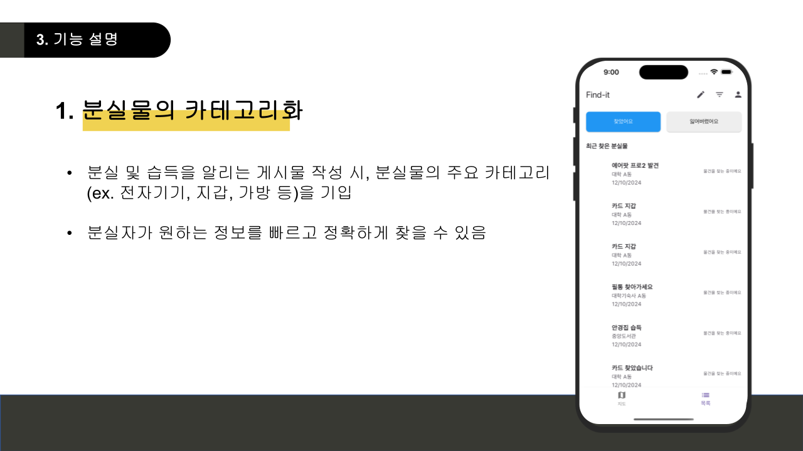
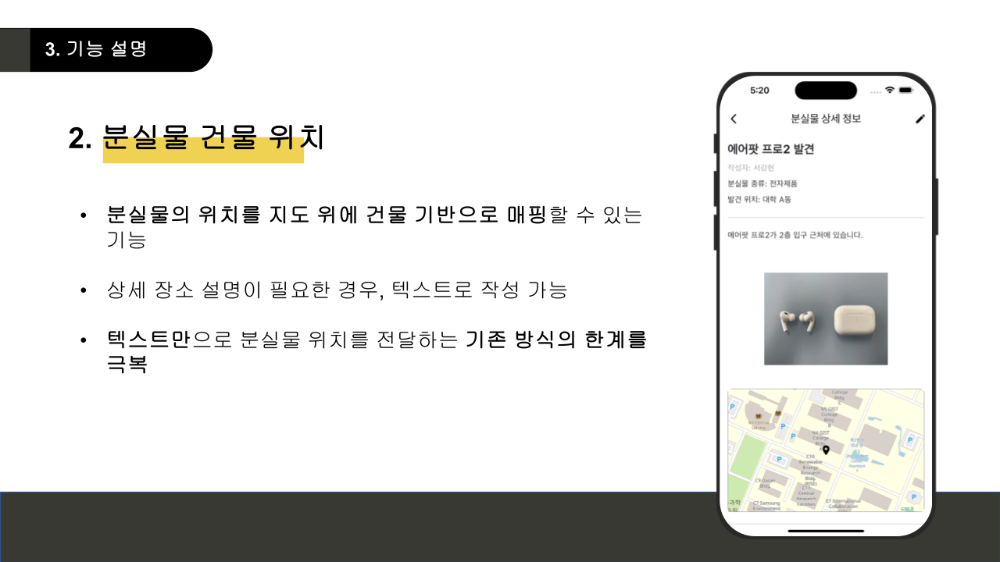
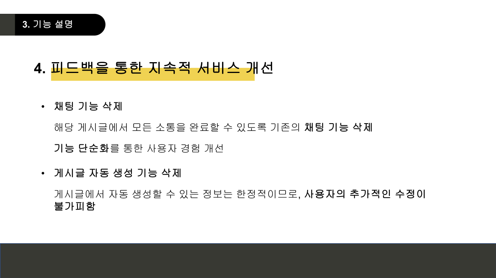
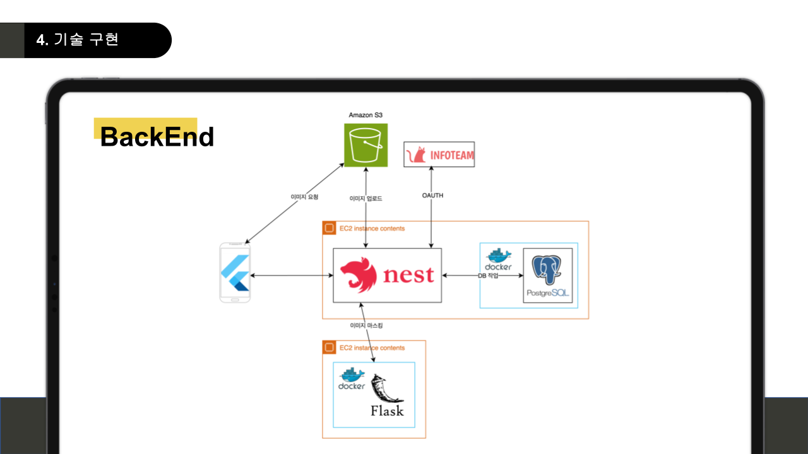
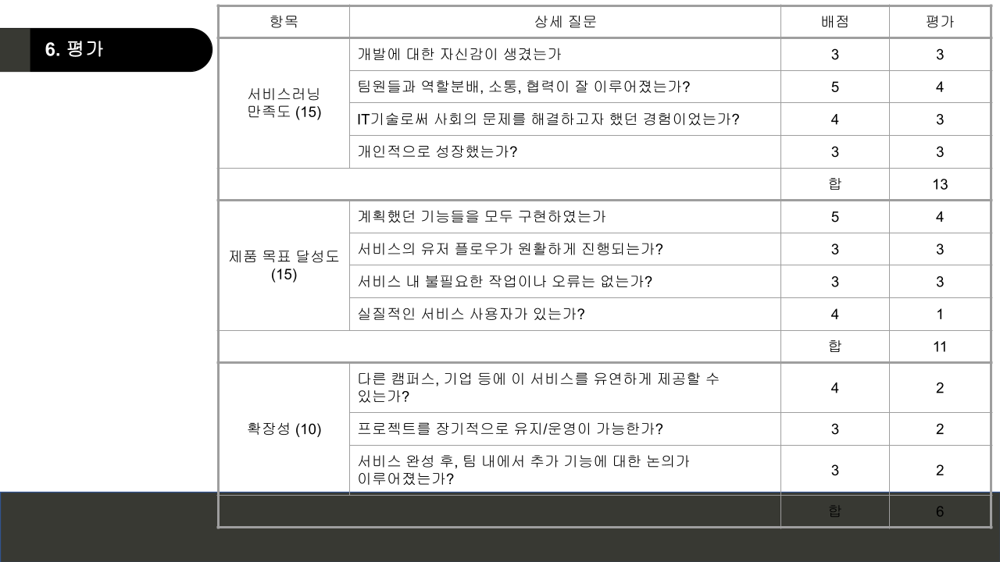
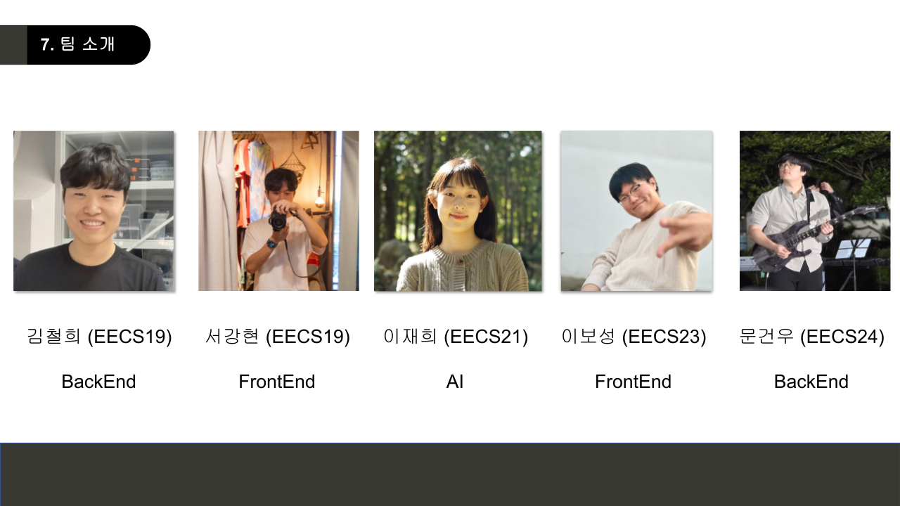

# 교내 분실물 찾기 커뮤니티, Find-It

[Find-It FrontEnd link](https://github.com/wang-bam-bbang/find-it-flutter)

[Find-It BackEnd link](https://github.com/wang-bam-bbang/find-it-be)

[Find-It AI link](https://github.com/jaehee831/find-it-ai)

[Project Team Repository](https://github.com/wang-bam-bbang)

